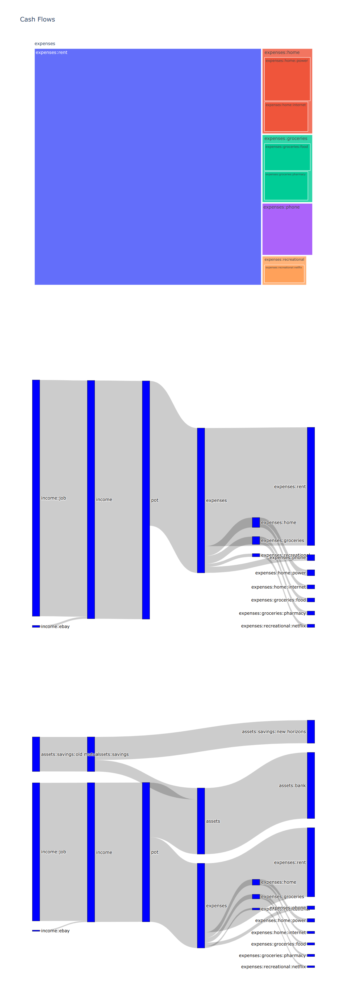

# hledger-sankey
A python3 script (that uses plotly, tested with plotly 6.5.0) to plot three graphs:

- treemap graph of all expenses

- sankey graph of income vs expense money flows

- sankey graph of money flows between income, expenses, assets and liabilities account categories

# Usage it
Run `python3 sankey.py example.journal`, and this should open the page with interactive graphs in your browser.

# Try it
Repository contains `example.journal` generated out of slighly edited `Cody.journal` from hledger examples.

# Assumptions
This is a proof of concept, and it is a bit rough round the edges.

Patches to make it more robust are very welcome

Script makes a bunch of assumptions:

- `hledger` is in your path

- income, expenses, assets and liabilities categories in
  your chart of accounts are named exactly this

- your balances could be obtained in '£' via `--value=then,£` flags for `hledger balance`. You can use `--commodity` command line switch to choose a different commodity.

If these assumptions do not hold for you, edit the script.

# How would it look like

