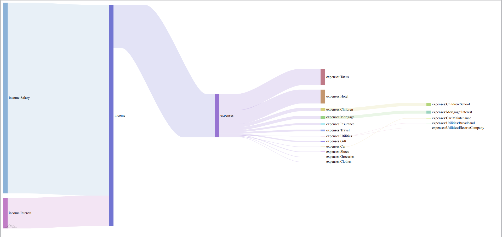
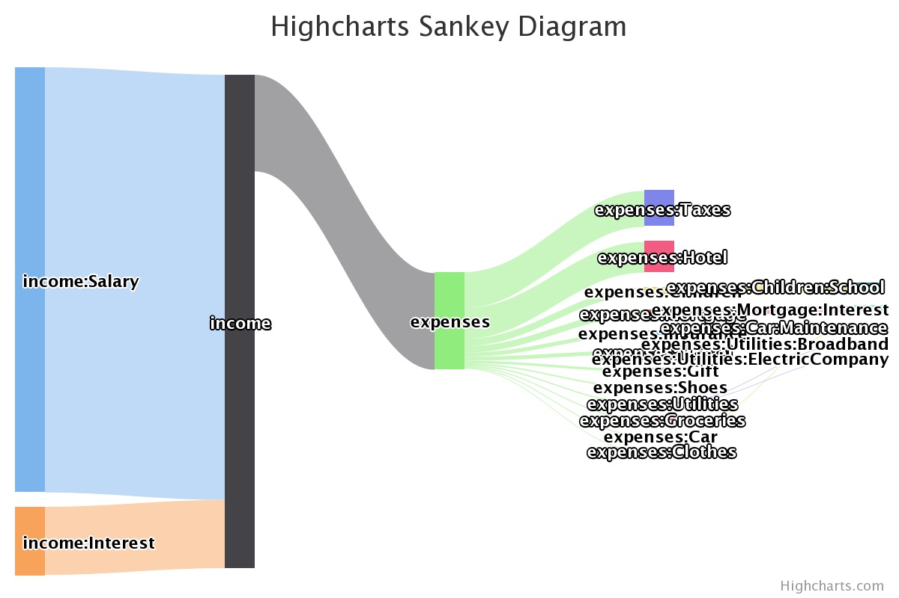

# hledger-sankey
Script + html files to plot income vs expense money flows from hledger ledger

This is a proof of concept that I hacked in a hurry to see if this could be done and to compare different JavaScript implementations
of Sankey graph plotters.

# Use it
Run `./sankey.sh /path/to/your.ledger`, which will generate `sankey.csv` in the `html` subdirectory.
Copy whole `html` subdirectory so that it is accessible over http(s). Open supplied html files and see the graphs.

NB: opening files locally (via `file://` protocol) will not work! Csv data will not be fetched and you will not see graphs.

# Try it
Repository contains `sankey.csv` generated out of slighly edited `Cody.journal` from hledger examples.

# Assumptions
Script makes a bunch of assumptions:

- `bash` or sufficiently compatible shell

- `hledger`, `sed` and `awk` are in your path

- your commodity symbols are `$` or `£`

- your income and expenses account hierarchies are called just that -- `income` and `expenses`

- accounts with balances less than 50 will be ignored

- `incomestatement` report will be generated in cost basis (with `--cost` argument)

If these assumptions do not hold for you, edit the script.

# Examples
I personally hink that amscharts and highcharts yield the best results. Here is rendering of the sample file

## Amscharts

## Highcharts

